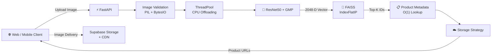

<div align="center">

# 👗 Visual Fashion Recommender API

### ⚡ High-Throughput Visual Similarity Search for E-Commerce

<p>
  
  
  
  
  
  
</p>

**Upload a fashion image → find visually similar products → return ranked product cards in milliseconds.**

**44K+ products · 2048-D embeddings · FAISS search · FastAPI · CDN-backed images**

</div>

---

## ✨ What Is This?

Traditional e-commerce search depends heavily on text.

But what if a user simply has a **photo of the clothing they want?**

This project provides a production-oriented **visual search API** that converts an uploaded fashion image into a deep visual representation, searches a catalog of **44,000+ products**, and returns the most visually similar products with their metadata and CDN URLs.

### 🚀 Key Highlights

|    | Capability                                           |
| -- | ---------------------------------------------------- |
| 🧠 | **ResNet50 + GlobalMaxPooling2D** feature extraction |
| 🔎 | **FAISS** vector similarity search                   |
| ⚡  | ~**38ms end-to-end API latency**                     |
| 📦 | **44,441 indexed products**                          |
| 🧮 | **2048-dimensional L2-normalized embeddings**        |
| ☁️ | **Supabase CDN** for product images                  |
| 🚫 | **Zero-disk image ingestion**                        |
| 🔄 | Non-blocking FastAPI inference                       |
| 🧩 | Pluggable storage provider architecture              |

---

# 🏗️ Architecture

The system keeps the latency-critical path entirely in memory.



### 🔄 Request Flow

**Upload → Validate → Extract Features → Vector Search → Metadata Lookup → CDN URLs**

The model, embeddings, FAISS index, and catalog metadata are loaded once during application startup and reused across requests.

---

# ⚙️ Production Engineering

This isn't just a notebook model wrapped in an API. Several decisions were made specifically for **low latency and concurrent serving**.

### 1. 🧠 In-Memory Model & Index

The ResNet50 model, 44K+ embeddings, FAISS index, and catalog metadata are loaded during FastAPI's lifespan.

**Why?**

Repeatedly loading a ~90 MB model or embeddings would introduce significant latency and unnecessary I/O.

> **Load once → serve many requests.**

---

### 2. ⚡ Cosine Similarity → Inner Product

All catalog vectors are **L2-normalized offline**.

Therefore:

```text
Cosine Similarity(A, B) = A · B
```

This allows the system to use:

**FAISS `IndexFlatIP`**

instead of calculating cosine similarity manually for every query.

Result:

> 🔥 **~1.5ms vector search**

---

### 3. 🔄 Non-Blocking Inference

TensorFlow inference is CPU-bound and synchronous.

Running it directly inside an async event loop could block other requests.

The API therefore uses:

```python
run_in_threadpool(...)
```

This keeps the ASGI event loop responsive while inference runs in worker threads.

---

### 4. 🚫 Zero-Disk Image Processing

Uploaded images never need to be written to `/tmp`.

Instead:

```text
Upload
  ↓
BytesIO
  ↓
Pillow
  ↓
TensorFlow
```

Everything remains in memory, reducing unnecessary disk I/O and cleanup overhead.

---

### 5. 🧩 Pluggable Storage Strategy

Image storage isn't hardcoded into the ML engine.

The storage layer can resolve product assets through different providers:

```text
                Storage Strategy
                       │
          ┌────────────┼────────────┐
          ↓            ↓            ↓
       Supabase     Cloudflare     Local
          CDN           R2         Storage
```

The backend therefore remains independent from the underlying storage provider.

---

# 📊 Performance

Benchmarked against a naive disk-based / loop-based approach:

| Metric             | Naive Approach | This Architecture |
| ------------------ | -------------: | ----------------: |
| Feature Extraction |        ~45 min |      **~3.5 min** |
| Vector Search      |       45–80 ms |       **~1.5 ms** |
| API Latency        |        450 ms+ |        **~38 ms** |
| Concurrency        |       Blocking |  **Non-blocking** |

### ⚡ Optimization Summary

* **12.8× faster** feature extraction
* **~30× faster** vector search
* **~11.8× lower** end-to-end latency

The original benchmark attributes these improvements to batch/GPU extraction, FAISS inner-product search, and RAM-cached inference.

---

# 📡 API

## `GET /health`

Simple readiness and model/index health check.

```json
{
  "status": "ready",
  "total_indexed_items": 44441,
  "embedding_dimension": 2048,
  "model_loaded": true
}
```

---

## `POST /recommend`

Find visually similar products.

### Request

```http
POST /recommend?top_k=3
Content-Type: multipart/form-data
```

| Parameter | Type    | Description                 |
| --------- | ------- | --------------------------- |
| `file`    | Image   | JPG, JPEG, PNG or WebP      |
| `top_k`   | Integer | Number of recommendations   |
|           |         | Default: `5`, Maximum: `50` |

### Response

```json
{
  "total_results": 3,
  "query_image_name": "sample_query.jpg",
  "results": [
    {
      "rank": 1,
      "product_id": "15970",
      "filename": "15970.jpg",
      "image_url": "...",
      "similarity_score": 0.8942,
      "product_name": "Turtle Check Men Navy Blue Shirt",
      "gender": "Men",
      "master_category": "Apparel",
      "sub_category": "Topwear",
      "article_type": "Shirts",
      "base_colour": "Navy Blue",
      "season": "Fall",
      "year": 2011,
      "usage": "Casual"
    }
  ]
}
```

---

# 🚀 Quick Start

### Requirements

* Python **3.10 / 3.11**
* [`uv`](https://github.com/astral-sh/uv)
* Pre-computed model artifacts
* Supabase storage bucket

### 1. Clone

```bash
git clone https://github.com/your-username/fashion-recommender-api.git
cd fashion-recommender-api
```

### 2. Install

```bash
uv sync
```

### 3. Configure

Create `.env`:

```env
STORAGE_BACKEND=cdn

CDN_BASE_URL=https://<your-project-id>.supabase.co/storage/v1/object/public/images

DEFAULT_TOP_K=5
MAX_TOP_K=50
```

### 4. Add Artifacts

```text
artifacts/
├── embeddings.npy
├── filenames.pkl
└── styles.csv
```

### 5. Start the API

```bash
uv run uvicorn app.main:app --host 0.0.0.0 --port 8000 --reload
```

---

# 📂 Project Structure

```text
fashion-recommender-api/
│
├── artifacts/
│   ├── embeddings.npy
│   ├── filenames.pkl
│   └── styles.csv
│
├── app/
│   ├── __init__.py
│   ├── config.py
│   ├── schemas.py
│   ├── storage.py
│   ├── model.py
│   ├── main.py
│   └── utils/
│       └── upload_to_supabase.py
│
├── pyproject.toml
├── .env.example
├── .gitignore
└── README.md
```

---

# 🛠️ Tech Stack

| Layer                 | Technology                    |
| --------------------- | ----------------------------- |
| 🧠 ML                 | TensorFlow / Keras            |
| 👁️ Feature Extractor | ResNet50 + GlobalMaxPooling2D |
| 🔎 Vector Search      | Meta FAISS                    |
| ⚡ API                 | FastAPI                       |
| 🚀 Server             | Uvicorn / ASGI                |
| 📦 Package Manager    | uv                            |
| ☁️ Storage            | Supabase                      |
| 🖼️ Image Processing  | Pillow                        |
| 📊 Data               | NumPy / Pandas                |

---

# 🎯 Why This Project Matters

This project demonstrates more than image similarity.

It brings together:

**Computer Vision**

→ **Vector Search**

→ **Low-Latency Inference**

→ **Async API Design**

→ **Cloud Object Storage**

→ **Production-Oriented Architecture**

The goal was to build a system that doesn't just **work**, but can serve visual-search requests efficiently while keeping the ML and infrastructure layers cleanly separated.

---

<div align="center">

### 👨‍💻 Built with a focus on

**Low Latency · Clean Architecture · Scalable ML Serving**

⭐ Star the repository if you find it useful!

</div>
